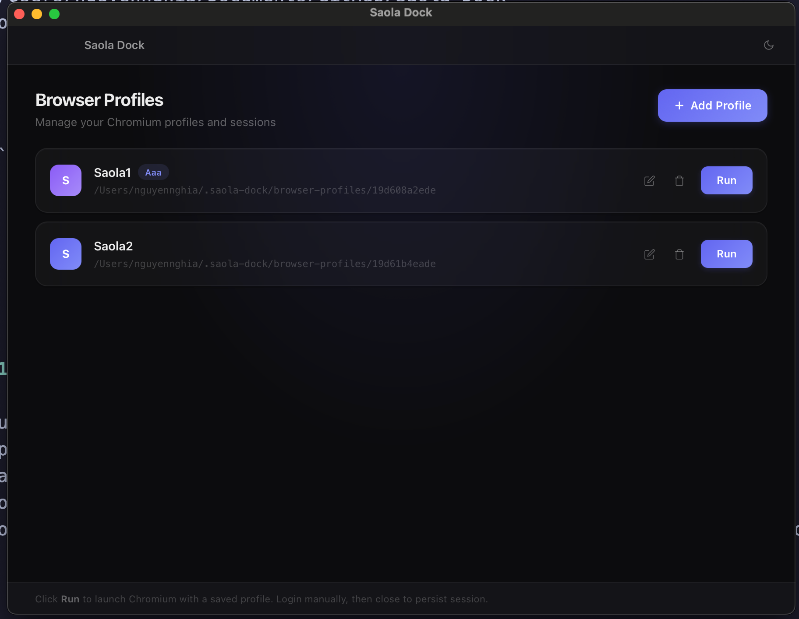

# Saola Dock

A simple, open-source browser profile manager built with **Tauri (Rust + React)**. Create isolated Chromium profiles and let AI control them via a local HTTP server.



## How It Works

```
User clicks "Run"
    → Tauri spawns: node browser-server.js <profileDir>
    → Puppeteer launches Chrome with that profile
    → Node HTTP server starts on random port (127.0.0.1)
    → Port returned to Tauri UI

User clicks "Copy Prompt"
    → Copies a ready-made prompt (with port) to clipboard

User pastes prompt into AI (Claude, ChatGPT, etc.)
    → AI calls POST http://127.0.0.1:<port>/action to control the browser
```

- **localhost only** — nothing exposed to the network
- **1 profile = 1 server** — each profile runs independently
- **Persistent sessions** — login once, sessions are saved in the profile

## API

All commands go through `POST http://127.0.0.1:<port>/action` with JSON body:

| Action | Body | Description |
|---|---|---|
| `navigate` | `{ "action": "navigate", "url": "https://..." }` | Go to URL |
| `click` | `{ "action": "click", "selector": "#btn" }` | Click element |
| `type` | `{ "action": "type", "selector": "input", "value": "hello" }` | Type text |
| `screenshot` | `{ "action": "screenshot" }` | Capture page (base64 JPEG) |
| `get_text` | `{ "action": "get_text", "selector": "body" }` | Extract text content |
| `get_html` | `{ "action": "get_html" }` | Get cleaned HTML (no scripts/styles) |
| `scroll` | `{ "action": "scroll", "value": "500" }` | Scroll down N pixels |
| `wait` | `{ "action": "wait", "selector": ".loaded" }` | Wait for element |
| `evaluate` | `{ "action": "evaluate", "value": "() => document.title" }` | Run JS |
| `current_url` | `{ "action": "current_url" }` | Get current URL & title |

## Tips for AI Usage

When pasting the prompt into AI, keep in mind:

- **Prefer `get_html`/`get_text` over `screenshot`** — text-based actions are faster and use fewer tokens
- **Only use `screenshot` when DOM isn't enough** — e.g., canvas, iframes, complex visual layouts
- A dedicated AI skill/prompt that follows this priority can significantly reduce token cost

## Getting Started

### Prerequisites
- [Node.js](https://nodejs.org/) (v18+)
- [Rust](https://www.rust-lang.org/tools/install)
- Chromium/Chrome installed

### Install & Run

```bash
npm install
npm run tauri dev
```

### Build

```bash
npm run tauri build
```

## Tech Stack

- **Frontend:** React 19 + TypeScript + Tailwind CSS 4
- **Backend:** Tauri 2 (Rust)
- **Browser automation:** Puppeteer
- **State:** Zustand

## License

MIT
